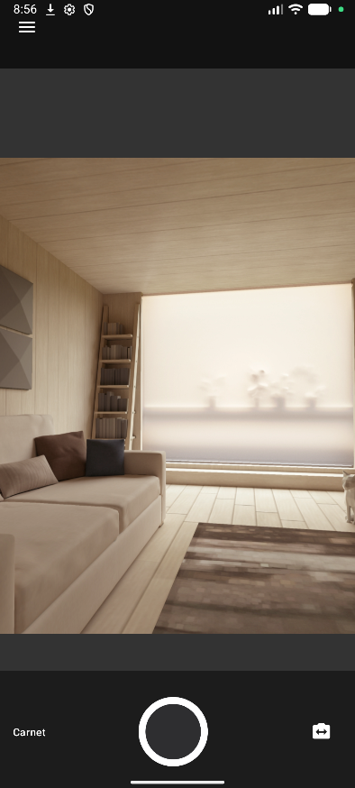
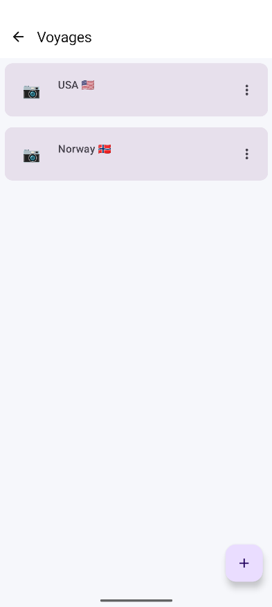
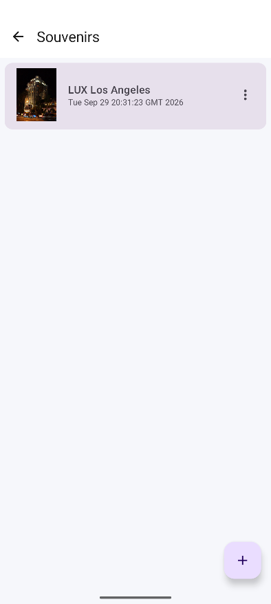
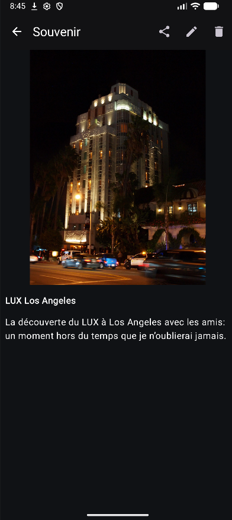

# Carnet de voyage

Application Android de carnet de voyage permettant de capturer, organiser et consulter des souvenirs photo et vidéo dans des carnets locaux.

## Fonctionnalités

- Capture de photos et de vidéos avec CameraX, avec bascule caméra avant/arrière et zoom.
- Création, modification et suppression de carnets de voyage.
- Ajout de médias depuis la galerie aux souvenirs d’un carnet.
- Aperçu avant enregistrement, titres et descriptions pour les souvenirs.
- Consultation, modification, suppression et partage de souvenirs.
- Lecture vidéo avec Media3 et affichage de localisation lorsque des coordonnées GPS sont présentes dans les métadonnées et qu’un géocodage est disponible.
- Thème clair/sombre mémorisé localement.
- Stockage local des données avec Room et des fichiers média dans le stockage interne privé de l’application.
- Migration Room de la version 1 vers la version 2 pour conserver les carnets et les anciens souvenirs photo ; suppression d’un carnet et de ses souvenirs dans une transaction.

> L’accès à la caméra et au microphone dépend des permissions accordées par l’utilisateur et des capacités de l’appareil. Le géocodage dépend des services Android disponibles.

## Technologies

- Kotlin et Jetpack Compose
- Material 3
- Navigation Compose
- ViewModel et Coroutines/Flow
- Room, avec traitement d’annotations KAPT et export des schémas dans `app/schemas/`
- CameraX
- Coil
- Media3 / ExoPlayer
- DataStore Preferences
- ExifInterface

## Architecture

Les écrans Compose consomment les états exposés par les ViewModels. Les ViewModels délèguent les opérations de données au repository, qui utilise les DAO Room pour les données persistantes.

```text
UI Compose → ViewModel → TravelRepository → DAO → Room
```

Le ViewModel caméra gère certains états d’interface liés à la capture ; CameraX est configuré dans l’écran caméra et lié au cycle de vie Android.

## Aperçu

### Écran caméra


### Carnets de voyage


### Souvenir


### Dark mode (détail d'un souvenir)



## Prérequis

- Android Studio avec prise en charge d’Android Gradle Plugin 8.13.2.
- JDK 17 (le Gradle Wrapper utilise cette JVM pour la construction).
- Android SDK Platform 36 installé via le SDK Manager.
- Connexion Internet lors de la première synchronisation Gradle pour télécharger le Wrapper et les dépendances.

Aucun fichier `local.properties` préconfiguré n’est requis : Android Studio ou l’installation locale du SDK doit fournir le chemin Android SDK sur chaque machine. Ce fichier local ne doit pas être publié.

## Installation et lancement

1. Cloner le dépôt et l’ouvrir dans Android Studio.
2. Installer le JDK 17 et la plateforme Android SDK 36 si Android Studio le demande.
3. Laisser Gradle synchroniser le projet.
4. Lancer la configuration `app` sur un appareil ou un émulateur compatible. La capture nécessite un appareil doté d’une caméra ; l’enregistrement audio vidéo nécessite aussi l’autorisation microphone.

Depuis la racine du dépôt, les commandes Gradle sont :

```bash
./gradlew assembleDebug
./gradlew testDebugUnitTest
```

Sous Windows, utiliser `gradlew.bat` à la place de `./gradlew`.

## Tests

Le projet contient un test JVM du ViewModel des voyages, utilisant des DAO de test en mémoire. Il vérifie que l’ajout d’un voyage met à jour l’état observé.

## Contexte

Projet réalisé dans le cadre du bachelier en informatique à HE2B ESI.
